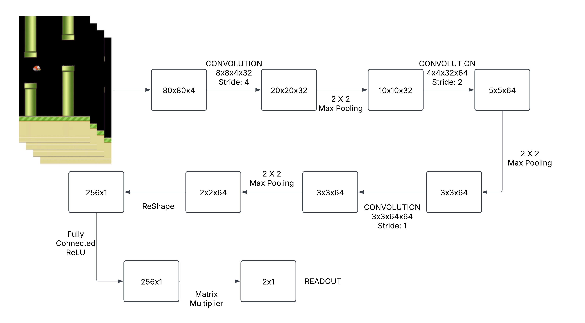

# Using Deep Q-Network to Learn How To Play Flappy Bird


## Overview
This project implements the Deep Q-Learning algorithm based on established reinforcement learning principles and demonstrates its applicability to the well-known game Flappy Bird.

## Installation Dependencies:
* Python 2.7 or 3
* TensorFlow 0.7
* pygame
* OpenCV-Python
* numpy
## Installation
```bash
# Clone the repository
git clone https://github.com/your-username/Ai-project.git
cd Ai-project

# Set up a virtual environment (recommended)
python -m venv venv
source venv/bin/activate  # On Windows: venv\Scripts\activate

# Install dependencies
pip install tensorflow pygame opencv-python numpy
```

## How to Run
```bash
# Train the model from scratch
python deep_q_network.py

# Run with a pretrained model
python deep_q_network.py --mode=test
```

## Understanding Deep Q-Networks

DQN combines Q-learning with deep neural networks to handle complex state spaces like game screens. The neural network takes raw pixels as input and outputs estimated future rewards (Q-values) for each possible action. This allows the agent to make decisions that maximize long-term reward.

The core algorithm:

```
Initialize replay memory with capacity N
Initialize Q-network with random weights
For each episode:
    Reset game state
    While game is active:
        With probability ε select random action
        Otherwise select action with highest Q-value
        Execute action and observe reward and new state
        Store experience tuple (state, action, reward, next_state) in replay memory
        Sample random batch from replay memory
        Update Q-network weights using gradient descent
        Update state
```

## Implementation Details

### Preprocessing Pipeline
To simplify learning, game screens undergo preprocessing:

1. Grayscale conversion
2. Resize to 80×80 pixels
3. Stack 4 consecutive frames as input (80×80×4)

### Neural Network Architecture

The agent uses a convolutional neural network:

- Input layer: 80×80×4 (four stacked frames)
- Convolutional layer 1: 32 filters (8×8), stride 4, ReLU activation
- Max pooling layer: 2×2 pool size
- Convolutional layer 2: 64 filters (4×4), stride 2, ReLU activation
- Max pooling layer: 2×2 pool size
- Convolutional layer 3: 64 filters (3×3), stride 1, ReLU activation
- Max pooling layer: 2×2 pool size
- Fully connected layer: 256 neurons, ReLU activation
- Output layer: 2 units (flap/don't flap)



### Training Configuration

- Replay memory size: 500,000 experiences
- Minibatch size: 32
- Discount factor (γ): 0.99
- Initial exploration rate (ε): 0.1
- Final exploration rate: 0.0001
- Exploration annealing frames: 3,000,000
- Optimizer: Adam with learning rate 1e-6
- Target network update frequency: Every 10,000 steps

## Experimental Results

After approximately 1,500,000 frames of training, the agent consistently achieves scores of 300+ points, showing significant improvement over random play (average score: 12). The agent develops strategies to maintain optimal height and time its flaps precisely when approaching pipes.

## Technical Considerations

The initial training phase uses exploration to build experience. The agent acts randomly for 10,000 frames before training begins. I chose a starting exploration rate (ε) of 0.1 rather than 1.0 to prevent excessive flapping that would keep the bird at the top of the screen, limiting exploration of the state space.

## Troubleshooting

### Checkpoint Errors
If you encounter checkpoint errors, check that the path in `saved_networks/checkpoint` points to an existing model file.

### Performance Issues
For GPU memory management:
```python
import tensorflow as tf
gpus = tf.config.experimental.list_physical_devices('GPU')
if gpus:
    tf.config.experimental.set_memory_growth(gpus[0], True)
```

## References

1. Mnih et al. "Human-level Control through Deep Reinforcement Learning." Nature, 2015.
2. Mnih et al. "Playing Atari with Deep Reinforcement Learning." NIPS Deep Learning Workshop, 2013.
3. Van Hasselt et al. "Deep Reinforcement Learning with Double Q-learning." AAAI, 2016.
4. Schaul et al. "Prioritized Experience Replay." ICLR, 2016.
